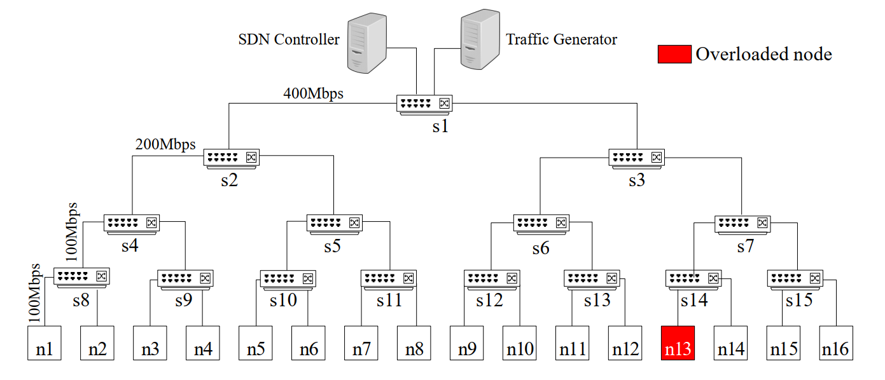

# Fog-to-Fog Offloading in SDN-based FC Systems

This is simulation scripts for my paper (Fog-to-Fog Offloading in SDN-based Fog Computing Systems). The paper is under review (2020-11-18).

## Topology


## Environment

- Ubuntu 18.04
- Python 2

## Installation

Use the package manager [pip](https://pip.pypa.io/en/stable/) to install simulation tools.

```bash
sudo pip install ryu
# The lastest ryu version can only run with tinyrpc <=0.9.4
sudo pip install tinyrpc==0.9.4


# Install mininet from source
git clone git://github.com/mininet/mininet
cd mininet
git tag  # list available versions
git checkout -b 2.2.1 2.2.1  # or whatever version you wish to install
cd .
mininet/util/install.sh

sudo pip install flask
sudo pip install flask_restful


```

## Usage
Run the make_config.py to init the setting of each running

```bash
python make_config.py
```

You need two Terminal to run the simulation

```bash
# Terminal 1 for Controller 
sudo ryu-manager --observe ryu_network_monitor.py

# For 8 nodes topology
sudo ryu-manager --observe ryu_network_monitor8.py


# Terminal 2 for mininet
sudo ./run_sim.sh

# For 8 nodes topology
sudo ./run_sim8.sh
```


## Contact
If you have any problem in running the scripts, please email me at linhan90 [at] gmail [.] com

